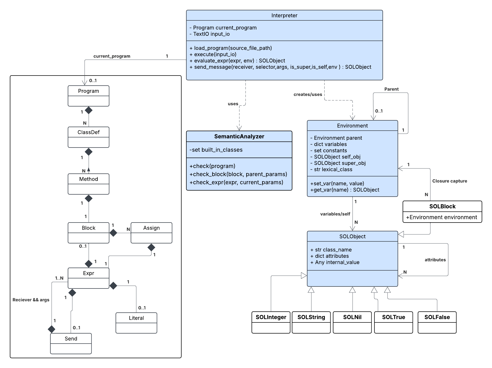

# Dokumentace IPP 2025/2026
## Interpret SOL26

> **Autor:** Mikoláš Bartoň (xbartom00)

---

## Obsah

1. [Celkový návrh řešení](#1-celkový-návrh-řešení)
2. [UML Diagram tříd](#2-uml-diagram-tříd)
3. [Hlavní interní datové struktury](#3-hlavní-interní-datové-struktury)
4. [Využití návrhových vzorů a principů OOP](#4-využití-návrhových-vzorů-a-principů-oop)
5. [Zásadní implementační problémy a jejich řešení](#5-zásadní-implementační-problémy-a-jejich-řešení)
6. [Možnosti dalšího rozšiřování](#6-možnosti-dalšího-rozšiřování)
7. [Využití nástrojů umělé inteligence](#7-využití-nástrojů-umělé-inteligence)

---

## 1. Celkový návrh řešení

Běh interpretu je logicky rozdělen do tří hlavních fází a klíčovým mechanismem projektu je předávání zpráv.

### Průběh interpretace

* **Fáze 1: Načtení a syntaktická analýza**
  
    Ze vstupního souboru ve formátu SOL-XML je načten zdrojový kód. K jeho zpracování je využita knihovna `lxml` a pomocí Pydantic modelů z dodané šablony je sestaven abstraktní syntaktický strom (AST) reprezentovaný kořenovým objektem třídy `Program`.

* **Fáze 2: Statická sémantická analýza**
  
    Sestavený AST je následně zpracován izolovanou instancí třídy `SemanticAnalyzer`. Tento analyzátor projde celý strom a před samotným spuštěním programu ověří dodržení statických pravidel jazyka. Kontrolována je zejména:
    * existence hlavního vstupního bodu (třída `Main` a bezparametrická metoda `run`),
    * platnost hierarchie dědičnosti (existence definovaných nadtříd),
    * absence kolizí v názvech formálních parametrů uvnitř bloků,
    * shoda arity deklarovaných selektorů s aritou příslušných metodových bloků.

* **Fáze 3: Spuštění a inicializace kontextu**
  
    Po úspěšné analýze je vytvořena úvodní instance třídy `Main` a inicializuje se globální prostředí vázané na instanci třídy `Environment`. Toto prostředí uchovává aktuální kontext (`self_obj`, `super_obj`) a  vlastníka vyhodnocované metody (`lexical_class`), což je nezbytné pro správné fungování lexikálních uzávěrů a klíčového slova `super`. Běh programu je zahájen vyhodnocením bloku metody `run`.

### Jádro interpretace a řízení toku

* **Předávání zpráv:**

 Srdcem interpretace je metoda `send_message`. Jelikož je SOL26 čistě objektový jazyk, veškeré operace (včetně aritmetiky či přístupu k atributům) jsou realizovány výhradně zasíláním zpráv. Metoda `send_message` dynamicky reaguje na třídu příjemce (potomci `SOLObject` a `ClassLiteral`). Nejprve zkouší odbavit vestavěné operace základních typů. V případě uživatelských tříd prohledává řetězec dědičnosti s ohledem na lexikální kontext (`is_self`, `is_super`) a při nenalezení metody přechází k obsluze instančních atributů (přičemž detekuje kolize s bezparametrickými metodami).

 **Řízení toku programu (podmínky a cykly):**

* Řízení toku není v jazyce SOL26 řešeno if/while příkazy, ale plně využívá čistě objektového přístupu a předávání zpráv.
    * **Podmínky (`ifTrue:ifFalse:`):** Jsou realizovány zasláním zprávy instancím vestavěných tříd `SOLTrue` a `SOLFalse`. Třída `True` jednoduše provede první blok, zatímco `False` ignoruje první a provede druhý blok.
      ```python
      # Ukázka z interpreter.py (vyhodnocení pro třídu True)
      if selector == "ifTrue:ifFalse:" and len(args) == 2:
          # ... validace arity ...
          block_arg0 = cast(SOLBlock, args[0])
          return self.evaluate_block(block_arg0.internal_value, block_arg0.environment)
      ```
    * **Cykly (`whileTrue:`):** Cyklus je implementován jako zpráva zaslaná instanci třídy `Block`. Interpret ve smyčce nejprve vyhodnotí blok příjemce (podmínku), a pokud vrací objekt třídy `True`, provede blok předaný v argumentu (tělo cyklu).
      ```python
      # Ukázka z interpreter.py (vyhodnocení pro třídu Block)
      if selector == "whileTrue:" and len(args) == 1:
          body_obj = args[0]
          while_res: SOLObject = SOLNil()
          while True:
              cond_result = self.send_message(receiver, "value", [], False, False, env)
              if cond_result.class_name != "True":
                  break
              while_res = self.send_message(body_obj, "value", [], False, False, env)
          return while_res
      ```
---

## 2. UML Diagram tříd

Níže uvedený diagram zachycuje zjednodušenou architekturu aplikace. Třídy ze vstupního AST modelu (šablony) jsou uvedeny v levé části a zjednodušeny pro přehlednost. Jádro implementace je tvořeno třídou `Interpreter` a hierarchií běhových objektů `SOLObject`.


## 3. Hlavní interní datové struktury

### `Environment`
Slouží ke správě lokálních proměnných, parametrů bloku a kontextu běhu. Třída si pamatuje odkaz na nadřazené prostředí (`parent`), což umožňuje existenci lexikálních uzávěrů (closures). Klíčovou součástí je také uchování informací o aktuálním vlastníkovi metody (`lexical_class`), což je nezbytné pro správné fungování klíčového slova `super`.

### `SOLObject` a jeho potomci
Základní třída reprezentující libovolný objekt v paměti interpretu. Obsahuje slovník instančních atributů a název třídy. Její potomci (např. `SOLInteger`, `SOLString`, `SOLBlock`) přidávají datovou položku `internal_value` pro uchování nativní pythonovské hodnoty a její specifické chování v rámci vestavěných operací.

### Abstraktní syntaktický strom (AST)
Datové struktury poskytnuté v šabloně projektu (např. `Program`, `ClassDef`, `Method`, `Block`, `Assign`), které reprezentují vstupní kód programu po syntaktické a lexikální analýze ve formátu XML.

---

## 4. Využití návrhových vzorů a principů OOP

### Oddělení zodpovědností *(Separation of Concerns)*
Fáze statické sémantické kontroly byla vyčleněna z hlavní třídy `Interpreter` do samostatné třídy `SemanticAnalyzer`. To zajišťuje čistší návrh, zpřehledňuje samotnou třídu interpretu a umožňuje oddělené testování statické analýzy od běhové logiky.

### Polymorfismus na úrovni paměťového modelu
Všechny hodnoty a proměnné v programu reprezentuje společná třída `SOLObject` nebo její specializovaní potomci. Místo složitého zjišťování typů předává interpret zprávy objektům na základě prověření jejich předků (pomocí interní funkce `inherits_from`), přičemž každá instance (např. `SOLInteger`, `SOLString` či uživatelsky definovaná třída) reaguje na příchozí selektory svými vymezenými metodami. Zpracování tak není řešeno složitým větvením (switch-case), ale deleguje se na samotný paměťový model.

### Chain of Responsibility (Řetězec odpovědností) při správě paměti
Tento návrhový vzor je ukázkově využit ve třídě `Environment` pro modelování lokálních rozsahů platnosti a lexikálních uzávěrů (closures). 

* **Struktura řetězce:** Každý blok při svém spuštění obdrží instanci `Environment`, která drží slovník lokálních proměnných a odkaz na nadřazené prostředí v atributu `parent`.
* **Delegace požadavku (`get_var`):** Pokud interpret požaduje hodnotu proměnné, aktuální prostředí zkontroluje své lokální proměnné. Pokud proměnnou nenajde, samo požadavek deleguje na svého předka.
* **Zpracování nebo chyba:** Požadavek probublává řetězcem tak dlouho, dokud není proměnná nalezena, nebo dokud nedojde na konec řetězce (`None`), což vyústí ve statickou sémantickou chybu (výjimka `InterpreterError`).
  ```python
  # Ukázka z interpreter.py (aplikace Chain of Responsibility v Environment)
  def get_var(self, name: str) -> SOLObject:
      """Search variable in current scope, then recursively in parent scopes up chain."""
      if name in self.variables:
          return self.variables[name]
      
      # Delegace na další článek řetězce odpovědností
      if self.parent is not None:
          return self.parent.get_var(name)

      # Konec řetězce - požadavek nebylo možné vyřídit
      raise InterpreterError(ErrorCode.SEM_UNDEF, f"Undefined variable '{name}'")
---

## 5. Zásadní implementační problémy a jejich řešení

### Lexikální kontext pro `super` a tvorbu atributů

* Specifikace vyžaduje, aby klíčové slovo `super` nevyhledávalo metody podle třídy samotné instance, ale podle nadtřídy té třídy, ve které byla metoda fyzicky definována. Tento záludný problém lexikálního kontextu byl vyřešen rozšířením třídy `Environment` o atribut `lexical_class`. Během vyhledávání metod se do nového prostředí invokovaného bloku tento kontext uloží, a tím pádem mají všechny případné zanořené bloky přesnou informaci o tom, jaké třídě jejich definice přísluší.

### Integrace testovacího nástroje a překladače `sol2xml`

* Aby mohl testovací nástroj spolehlivě provádět end-to-end testy (kategorie `COMBINED`) nad zdrojovými kódy v jazyce SOL26, byla do odevzdaného archivu úmyslně přidána složka `sol2xml` s referenčním překladačem. 
---

## 6. Možnosti dalšího rozšiřování

### Rozšíření o mechanismus doesNotUnderstand

1. **Nová běhová třída**
   * V paměťovém modelu (konkrétně v `runtime.py`) by vznikla nová třída `SOLMessage` dědící ze `SOLObject`.
   * Její interní reprezentací by byla struktura uchovávající název původního selektoru a předané argumenty.
   * Objekt by uměl reagovat na následující zprávy:
     * `selector`: vrátí název metody jako `SOLString`.
     * `argumentCount`: vrátí počet argumentů jako `SOLInteger`.
     * `argument:`: vrátí konkrétní argument podle indexu. (specifikace jazyka SOL26 bez rozšíření nepodporuje datovým type pro pole či kolekce. Proto místo vracení celého pole se  s argumenty pracuje čistě objektově formou postupného dotazování).

2. **Úprava metody `send_message` (Zachycení selhání)**
   * Aktuálně metoda `send_message` vyhazuje chybu `INT_DNU` (kód 51), pokud nenalezne metodu ani atribut.
   * Nově by se místo okamžitého pádu vytvořil objekt `SOLMessage`.
   * Interpret by na původním příjemci rekurzivně zavolal něco jako: `self.send_message(receiver, "doesNotUnderstand:", [message_obj], ...)`.

3. **Ochrana proti zacyklení**
   * Aby se předešlo pádu interpretu (např. pokud by metoda `doesNotUnderstand:` chyběla nebo sama vyvolala neznámou zprávu), třída `Interpreter` by si udržovala zásobník probíhajících volání.
   * Před voláním by se na tento zásobník přidala unikátní dvojice `(id(receiver), selector)`.
   * Pokud by interpret při prohledávání zásobníku zjistil, že stejný příjemce už řeší DNU pro totožný selektor, okamžitě by vyvolal běhovou chybu 51.
   * Po úspěšném odbavení by se tento záznam ze zásobníku opět odebral.

4. **Výchozí fallback v základní třídě `SOLObject`**
   * Pro zajištění zpětné kompatibility by se chování integrovalo přímo do třídy `SOLObject`.
   * V této třídě by se definovala nativní metoda obsluhující selhání (např. metoda simulující zprávu `doesNotUnderstand:`).
   * Její implementací by bylo právě původní chování – vyhození výjimky `InterpreterError(ErrorCode.INT_DNU, ...)`.
   * Pokud by uživatelská třída v jazyce SOL26 tuto zprávu nepřepsala vlastní implementací, interpret by bezpečně propadl až k tomuto nativnímu chování v `SOLObject` a program by spadl standardním způsobem.

### Rozšíření o mechanismus výjimek (`on:do:` a `signal`)

Architektura s centralizovanou metodou `send_message` umožňuje snadnou integraci výjimek. Pro řízení toku a tzv. stack unwinding (probublávání zásobníku) se přímo využije nativní systém výjimek jazyka Python. Úpravy by spočívaly ve 4 krocích:

1. **Interní reprezentace (Třída např. `SOLException`)**
   Vytvoří se nová třída dědící z nativní třídy `Exception` z Pythonu. Bude sloužit jako přepravka – jako atribut si ponese přímo instanci třídy `SOLObject` (výjimku vytvořenou uvnitř jazyka SOL26).

2. **Vyhození výjimky (Zpráva `signal`)**
    V metodě send_message by se v sekci fallbacků pro Object přidal nový bezparametrický selektor signal. Reakcí na tuto zprávu by bylo interní výjimky s předáním příjemce zprávy: `raise SOLException(receiver)`.

3. **Zachycení výjimky (Zpráva `on:do:` pro `Block`)**
   Mezi operace třídy `Block` se přidá selektor `on:do:`. Samotné spuštění bloku v Pythonu se obalí do `try-except SOLException`. V bloku `except` se přes funkci `inherits_from` ověří, zda vyhozený objekt odpovídá odchytávané třídě. Pokud ano, spustí se záchranný `do:` blok. Pokud ne, výjimka se přepošle o úroveň výš.

4. **Výpis zásobníku (Stack Trace) a nezachycené chyby**
   Řídící smyčka se rozšíří o sledování historie volání – při vstupu do metody se na na `call stack ` zapíše jméno třídy a selektoru, při návratu se odstraní. Hlavní volání v metodě `execute` se obalí finálním `try-except`. Pokud výjimka probublá až sem, interpret korektně ukončí běh s příslušným chybovým kódem a zprávou na  `stderr `.
---

## 7. Využití nástrojů umělé inteligence

Během vypracování projektu byl využit generativní jazykový model **Google Gemini**.

**Způsob využití:**
Během rané fáze vývoje projektu jsem nástroje umělé inteligence nevyužíval zcela optimálním způsobem. Mé úvodní dotazy byly příliš obecné, což vedlo k tomu, že mi jazykový model vygeneroval rozsáhlejší ukázky kódu. Uvědomil jsem si však, že takový přístup neodpovídá inženýrskému cíli projektu.
Vygenerovaný kód jsem proto neaplikoval bezmyšlenkovitě, ale využil jsem jej primárně jako studijní materiál a referenční kostru. Tento postup mi pomohl pochopit podkladovou problematiku a zorientovat se v technologiích, se kterými jsem do té doby neměl takovou praxi – ukázalo mi to například, jak efektivně využít iterátory pro prohledávání souborů v PHP nebo jak správně nastavit multi-stage build v konfiguračním souboru kontejneru.

V pozdějších fázích projektu, jako byla například implementace statické sémantické kontroly, jsem již asistenta využíval striktně inženýrským a cíleným způsobem. Mé dotazy směřovaly na vysvětlení konkrétní úzké problematiky, diskuzi nad architekturou a hledání chyb (debugging) v mnou již napsaném kódu.
Při tvorbě dokumentace jsem AI nástroj použil v souladu s pravidly k stylistickým a gramatickým opravám mého textu .

**Link:** (https://gemini.google.com/share/f60ee1ef97ca)

---
