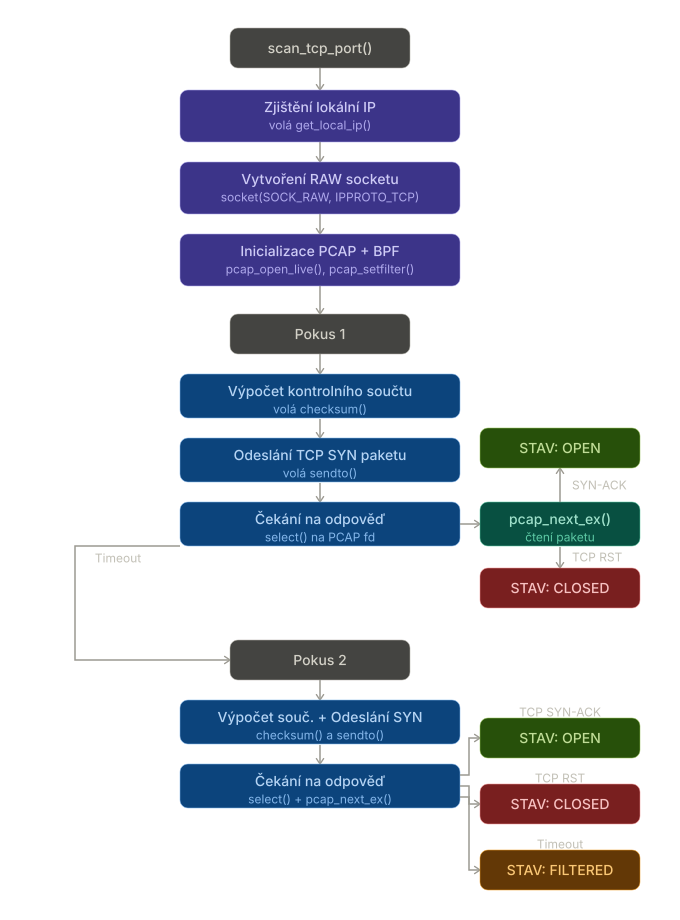
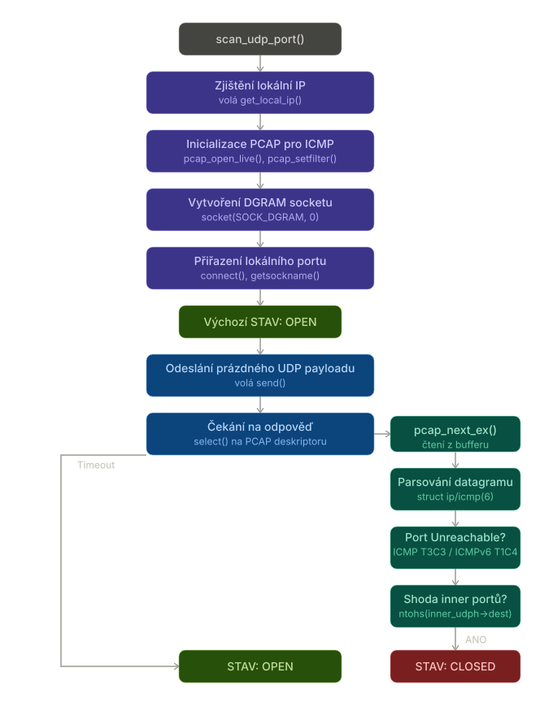

# IPK-L4-SCAN — Dokumentace (README.md)

## Obsah

1. [Přehled projektu](#1-přehled-projektu)
2. [Překlad a spuštění](#2-překlad-a-spuštění)
3. [Použití](#3-použití)
4. [Implementované funkce a chování](#4-implementované-funkce-a-chování)
5. [Důležitá návrhová rozhodnutí](#5-důležitá-návrhová-rozhodnutí)
6. [Testování](#6-testování)
7. [Známá omezení](#7-známá-omezení)
8. [Reference a zdroje](#8-reference-a-zdroje)

---

## 1. Přehled projektu

**ipk-L4-scan** je síťový skener transportní vrstvy (L4) implementovaný v jazyce C++. Skenuje TCP a UDP porty zadaného hostitele (hostname nebo IPv4/IPv6 adresa) prostřednictvím zvoleného síťového rozhraní a vypisuje stav každého skenovaného portu (`open`, `closed`, `filtered`).

Skener implementuje:
- **TCP SYN skenování** (half-open scan) — odešle SYN paket, vyhodnotí odpověď bez kompletního handshake
- **UDP skenování** — detekuje uzavřené porty na základě ICMP/ICMPv6 „Port Unreachable" zpráv
- Podpora **IPv4 i IPv6**
- Překlad **hostname** na více IP adres (DNS, duální stack)
- Konfigurovatelný **timeout**
- Čisté ukončení signály `SIGINT` a `SIGTERM`

> **Poznámka k platformě:** Program využívá raw sockety, libpcap a `SO_BINDTODEVICE` — tyto funkce jsou dostupné pouze na **Linuxu**.

---

## 2. Překlad a spuštění

### Požadavky

- Kompilátor `g++` s podporou C++20
- Knihovna `libpcap` (`libpcap-dev`)
- Root oprávnění nebo `CAP_NET_RAW` / `CAP_NET_ADMIN`

### Překlad

```bash
make
```

Cíl `make` zkompiluje projekt a vytvoří spustitelný soubor `ipk-L4-scan` v kořenovém adresáři projektu.

### Zjištění názvu vývojového prostředí

```bash
make NixDevShellName
```

Vypíše název Nix devShell potřebného pro překlad a spuštění (vrátí `c`).

### Spuštění automatizovaných testů

```bash
make test
```

### Makefile — přehled cílů

| Cíl | Popis |
|---|---|
| `make` | Přeloží projekt, vytvoří `./ipk-L4-scan` |
| `make NixDevShellName` | Vypíše název Nix devShell (`c`) |
| `make test` | Spustí automatizované testy |
| `make clean` | Odstraní zkompilované artefakty |

---

## 3. Použití

```
./ipk-L4-scan -i INTERFACE [-u PORTS] [-t PORTS] HOST [-w TIMEOUT]
./ipk-L4-scan -i
./ipk-L4-scan -h | --help
```

### Argumenty

| Argument | Popis |
|---|---|
| `-i INTERFACE` | Síťové rozhraní (např. `eth0`, `lo`). Bez hodnoty a bez dalších argumentů vypíše aktivní rozhraní. |
| `-t PORTS` | TCP porty ke skenování. Formáty: `22`, `1-65535`, `22,23,24`. |
| `-u PORTS` | UDP porty ke skenování. Stejný formát jako `-t`. |
| `-w TIMEOUT` | Timeout v ms pro čekání na odpověď. Výchozí: `1000`. |
| `HOST` | Hostname nebo IPv4/IPv6 adresa cíle. |
| `-h`, `--help` | Nápověda, exit kód 0. |

### Příklady

```bash
# Skenování TCP portů
sudo ./ipk-L4-scan -i eth0 -w 1000 -t 80,443,8080 www.vutbr.cz

# Skenování UDP portů na IPv6 adrese
sudo ./ipk-L4-scan -i eth0 -u 53,67 2001:67c:1220:809::93e5:917

# Kombinované skenování na localhostu
sudo ./ipk-L4-scan -i lo -t 21,22,143 -u 53,67 localhost

# Výpis aktivních síťových rozhraní
sudo ./ipk-L4-scan -i
```

---

## 4. Implementované funkce a chování

### Struktura projektu

```
projekt
|__src
  ├── main.cpp        # Vstupní bod
  ├── tcp.cpp / tcp.h # TCP SYN skenování přes raw sockety a libpcap
  ├── udp.cpp / udp.h # Skenování UDP přes ICMP/ICMPv6 odpovědi
  ├── Scanner.h       # Defiinuje rozhrní pro síťové skenování 
  ├── Scanner_base.cpp/Scanner_base.h  # Implementace pomocných funkcí pro spuštění
  |__ Utils.cpp/Utils.h  #Implementace pomocných funkcí pro síťové skenování
  └── common.h        # Sdílené typy (PortState enum, keep_running flag)
|_Makefile
|_LICENSE
|_README.md
|_CHANGELOG.md
|
|_tests
  |_python.py {testovací skript}
  ```

### TCP skenování

1. Vytvoří se raw TCP socket (`SOCK_RAW`, `IPPROTO_TCP`).
2. Sestaví se TCP segment s příznakem `SYN`; vypočítá se checksum přes pseudo-hlavičku.
3. Paket se odešle na cílový port (zdrojový port: `40000 + port % 10000 + pokus`).
4. Libpcap zachytává odpovědi přes BPF filtr `tcp and src port <port>`.
5. Výsledek dle přijaté odpovědi:

| Odpověď | Stav |
|---|---|
| `SYN-ACK` | `open` |
| `RST` | `closed` |
| Žádná (po 2 pokusech) | `filtered` |




### UDP skenování

1. Vytvoří se UDP socket; zjistí se lokální port přes `getsockname()`.
2. Odešle se jednobytový payload (`'\0'`).
3. Libpcap zachytává ICMP/ICMPv6 odpovědi; ověřuje se shoda portů v inner UDP hlavičce.
4. Výsledek dle přijaté odpovědi:

| Odpověď | Stav |
|---|---|
| ICMP typ 3, kód 3 / ICMPv6 typ 1, kód 4 | `closed` |
| Žádná odpověď do timeoutu | `open` |

### Výstupní formát

```
<IP_adresa> <port> <protokol> <stav>
```

Příklad:
```
127.0.0.1 22 tcp open
127.0.0.1 21 tcp closed
127.0.0.1 143 tcp filtered
2001:67c:1220:809::93e5:917 80 tcp open
```



### Ošetření signálů

Při `SIGINT`/`SIGTERM` je nastaven flag `keep_running = 0` (typ `volatile sig_atomic_t`). Skenování se ukončí po dokončení aktuálního portu, sockety a pcap handles jsou korektně zavřeny.

---

## 5. Důležitá návrhová rozhodnutí

### Použití libpcap pro příjem paketů

Raw socket v Linuxu nemusí spolehlivě přijímat odpovědi na SYN pakety (kernel může paket absorbovat nebo resetovat spojení). Libpcap pracuje na nižší úrovni a zachytí pakety dříve, než je zpracuje jaderný TCP stack. BPF filtr omezuje zpracovávané pakety pouze na relevantní provoz.

### Dva pokusy pro TCP filtered

Zadání vyžaduje, aby byl port označen jako `filtered` až po dvou neúspěšných pokusech. Implementace odešle SYN paket dvakrát (s různým zdrojovým portem), čímž eliminuje falešné výsledky způsobené ztrátou paketů v síti.

### Automatické přepínání na loopback rozhraní

Při skenování vlastního stroje (lokální IP, `127.0.0.1`, `::1`) se použije rozhraní `lo` bez ohledu na zadané `-i`, protože provoz na localhost nikdy neopustí loopback.

### Zjišťování lokální IP adresy

Funkce `get_local_ip()` využívá techniku UDP connect + `getsockname()` bez odeslání dat. Tím získá lokální IP adresu, kterou by kernel zvolil pro komunikaci s daným cílem — tato adresa je nutná pro správný výpočet TCP checksum.

### Výpočet TCP checksum

Checksum se počítá přes pseudo-hlavičku + TCP hlavičku, jak specifikuje RFC 793 (IPv4) a RFC 2460 (IPv6). Pro IPv6 je pseudo-hlavička rozšířena o 40bajtovou fixní IPv6 hlavičku.

### Volba zdrojového portu pro TCP

Zdrojový port je generován jako `40000 + (cílový_port % 10000) + číslo_pokusu`. Toto schéma zajišťuje různé zdrojové porty pro každý pokus a zároveň minimalizuje kolize s ostatními sockety.

### Nedefinované chování dle zadání — vlastní rozhodnutí

Zadání nedefinuje chování při zadání `-t`/`-u` bez hostitele — program vypíše chybovou zprávu na `stderr` a skončí s nenulovým exit kódem (fail-fast princip).

---

## 6. Testování

### Prostředí

- OS: Ubuntu 24.04 LTS (x86\_64)
- Kompilátor: g++ 13.2.0
- libpcap: 1.10.4
- Python: 3.12 (unittest)
- Síťová rozhraní: `lo` (loopback), `eth0` (Ethernet)
- Skenovaný stroj: lokální VM (skenování vlastního stroje)
- Testy musí být spuštěny jako root (raw sockety)

### Spuštění testů

```bash
sudo make test
```

Testy jsou implementovány v `tests/python.py` jako Python `unittest` sada (29 testů ve 4 třídách). Porty pro skenování jsou přidělovány dynamicky pomocí `socket.bind()` — tím se eliminují kolize s obsazenými porty a závislost na konkrétních službách.

### Přehled testovacích tříd

| Třída | Rozhraní | Host | Počet testů |
|---|---|---|---|
| `TestIPv4_lo` | `lo` | `127.0.0.1` | 5 |
| `TestIPv6_lo` | `lo` | `::1` | 5 |
| `TestIPv4_eth0` | `eth0` | IP rozhraní | 5 |
| `TestCLIArguments` | — | — | 14 |

---

### Skupina 1 — Skenování IPv4 na loopback (`TestIPv4_lo`)

**Prostředí:** rozhraní `lo`, host `127.0.0.1`

**Jak funguje dynamická alokace portů:** Python otevře dočasný socket přes `socket.bind((host, 0))`, OS přidělí volný port. Skener tento port skenuje. Po uzavření socketu je port okamžitě volný — skener pak vidí `closed`.

---

#### Test 1 — TCP otevřený port (IPv4)

**Co se testuje:** Port s aktivním TCP listenerem musí být reportován jako `open`.

**Proč se testuje:** Základní funkce TCP skenování — SYN-ACK odpověď musí být správně vyhodnocena.

**Jak se testuje:** Python otevře TCP socket na náhodném portu `P`, spustí skener, zkontroluje výstup.

**Vstup (příklad s portem P=51234):**
```bash
sudo ./ipk-L4-scan -i lo -t 51234 127.0.0.1
```

**Očekávaný výstup:**
```
127.0.0.1 51234 tcp open
```

**Skutečný výstup:**
```
127.0.0.1 51234 tcp open
```

**Výsledek:**    OK

---

#### Test 2 — TCP uzavřený port (IPv4)

**Co se testuje:** Port bez listeneru musí být reportován jako `closed` (RST odpověď).

**Proč se testuje:** Ověření, že RST je správně interpretován jako `closed`.

**Jak se testuje:** Python otevře socket na portu `P`, ihned ho zavře, pak spustí skener.

**Vstup (příklad s portem P=51235):**
```bash
sudo ./ipk-L4-scan -i lo -t 51235 127.0.0.1
```

**Očekávaný výstup:**
```
127.0.0.1 51235 tcp closed
```

**Výsledek:**    OK

---

#### Test 3 — TCP filtrovaný port (IPv4)

**Co se testuje:** Port blokovaný firewallem musí být reportován jako `filtered`.

**Proč se testuje:** Ověření logiky dvou pokusů — po uplynutí timeoutu bez jakékoliv odpovědi musí být stav `filtered`.

**Jak se testuje:** Python alokuje port `P`, přidá pravidlo `iptables -A INPUT -p tcp --dport P -j DROP`, spustí skener s `-w 500`, po testu pravidlo odstraní.

**Vstup (příklad s portem P=51236):**
```bash
sudo iptables -A INPUT -p tcp --dport 51236 -j DROP
sudo ./ipk-L4-scan -i lo -t 51236 -w 500 127.0.0.1
sudo iptables -D INPUT -p tcp --dport 51236 -j DROP
```

**Očekávaný výstup:**
```
127.0.0.1 51236 tcp filtered
```

**Výsledek:**    OK

---

#### Test 4 — UDP otevřený port (IPv4)

**Co se testuje:** UDP port s aktivním listenerem musí být reportován jako `open`.

**Proč se testuje:** Služba naslouchající na UDP portu absorbuje paket bez ICMP odpovědi — skener musí port označit jako `open`.

**Jak se testuje:** Python otevře UDP socket na portu `P`, spustí skener.

**Vstup (příklad s portem P=51237):**
```bash
sudo ./ipk-L4-scan -i lo -u 51237 127.0.0.1
```

**Očekávaný výstup:**
```
127.0.0.1 51237 udp open
```

**Výsledek:**    OK

---

#### Test 5 — UDP uzavřený port (IPv4)

**Co se testuje:** UDP port bez listeneru musí být reportován jako `closed`.

**Proč se testuje:** Ověření, že ICMP typ 3 kód 3 (Port Unreachable) je správně zachycen a interpretován jako `closed`.

**Jak se testuje:** Python otevře UDP socket na portu `P`, ihned ho zavře, spustí skener.

**Vstup (příklad s portem P=51238):**
```bash
sudo ./ipk-L4-scan -i lo -u 51238 127.0.0.1
```

**Očekávaný výstup:**
```
127.0.0.1 51238 udp closed
```

**Výsledek:**    OK

---

### Skupina 2 — Skenování IPv6 na loopback (`TestIPv6_lo`)

**Prostředí:** rozhraní `lo`, host `::1`

Stejná sada 5 testů jako skupina 1, ale pro IPv6. Ověřuje správné sestavení TCP checksum s IPv6 pseudo-hlavičkou a detekci ICMPv6 typ 1 kód 4 pro UDP closed.

**Příklad — TCP otevřený port (IPv6):**

**Vstup (příklad s portem P=51240):**
```bash
sudo ./ipk-L4-scan -i lo -t 51240 ::1
```

**Očekávaný výstup:**
```
::1 51240 tcp open
```

**Výsledek:**    OK (všech 5 testů)

---

### Skupina 3 — Skenování IPv4 na fyzickém rozhraní (`TestIPv4_eth0`)

**Prostředí:** rozhraní `eth0`, host = IP adresa detekovaná přes `ip -4 addr show eth0`

Stejná sada 5 testů jako skupina 1, ale přes fyzické síťové rozhraní. Ověřuje, že `SO_BINDTODEVICE` správně svazuje provoz s rozhraním a lokální IP adresa je správně detekována pro výpočet checksum.

**Příklad — TCP otevřený port (eth0):**

**Vstup (příklad s IP 192.168.1.10 a portem P=51250):**
```bash
sudo ./ipk-L4-scan -i eth0 -t 51250 192.168.1.10
```

**Očekávaný výstup:**
```
192.168.1.10 51250 tcp open
```

**Výsledek:**    OK (všech 5 testů)

---

### Skupina 4 — Validace CLI argumentů (`TestCLIArguments`)

**Prostředí:** nevyžaduje síťové rozhraní ani root (kromě testů iptables)

#### Test 11 — Nápověda `-h`

**Co se testuje:** Krátký přepínač `-h` musí vypsat nápovědu na stdout a skončit s kódem 0.

**Vstup:** `./ipk-L4-scan -h`

**Očekávaný výstup:** neprázdný stdout, exit kód 0

**Výsledek:**    OK

---

#### Test 12 — Nápověda `--help`

**Co se testuje:** Dlouhý přepínač `--help` musí fungovat stejně jako `-h`.

**Vstup:** `./ipk-L4-scan --help`

**Očekávaný výstup:** neprázdný stdout, exit kód 0

**Výsledek:**    OK

---

#### Test 13 — Výpis rozhraní

**Co se testuje:** `-i` bez hodnoty vypíše aktivní rozhraní a skončí s kódem 0.

**Vstup:** `./ipk-L4-scan -i`

**Očekávaný výstup:** stdout obsahuje `lo`, exit kód 0

**Výsledek:**    OK

---

#### Test 14 — Výpis rozhraní bez chybového výstupu

**Co se testuje:** `-i` bez hodnoty nesmí nic zapisovat na stderr.

**Vstup:** `./ipk-L4-scan -i`

**Očekávaný výstup:** stderr je prázdný

**Výsledek:**    OK

---

#### Testy 15–21 — Validace vstupů

**Co se testuje:** Chybné vstupy musí skončit s nenulovým exit kódem.

**Proč se testuje:** Robustnost parsování argumentů — program nesmí selhat nebo viset na neplatném vstupu.

| Test | Vstup | Proč | Očekávaný exit kód | Výsledek |
|---|---|---|---|---|
| T15 | `./ipk-L4-scan` | Žádné argumenty | nenulový |    OK |
| T16 | `-i lo -t 22` (bez HOST) | Chybějící HOST | nenulový |    OK |
| T17 | `-i lo --unknown localhost` | Neznámý argument | nenulový |    OK |
| T18 | `-i lo -t 0 localhost` | Port 0 mimo rozsah | nenulový |    OK |
| T19 | `-i lo -t 65536 localhost` | Port 65536 mimo rozsah | nenulový |    OK |
| T20 | `-i lo -t abc localhost` | Nečíselný port | nenulový |    OK |

---

#### Test 22 — Rozsah portů produkuje správný počet řádků

**Co se testuje:** Rozsah `-t 21-23` musí vyprodukovat přesně 3 výstupní řádky.

**Proč se testuje:** Ověření, že parsování rozsahu `start-end` správně iteruje všechny porty.

**Vstup:**
```bash
sudo ./ipk-L4-scan -i lo -t 21-23 -w 500 127.0.0.1
```

**Očekávaný výstup:** 3 řádky ve formátu `127.0.0.1 <port> tcp <stav>`

**Výsledek:**    OK

---

#### Test 23 — Čárkou oddělené porty produkují správný počet řádků

**Co se testuje:** `-t 21,22,23` musí vyprodukovat přesně 3 výstupní řádky.

**Proč se testuje:** Ověření, že parsování čárkou oddělených portů funguje správně.

**Vstup:**
```bash
sudo ./ipk-L4-scan -i lo -t 21,22,23 -w 500 127.0.0.1
```

**Očekávaný výstup:** 3 řádky ve formátu `127.0.0.1 <port> tcp <stav>`

**Výsledek:**    OK

---

#### Test 24 — Formát výstupních řádků

**Co se testuje:** Každý výstupní řádek musí mít přesně 4 pole: `<IP> <port> <tcp|udp> <open|closed|filtered>`.

**Proč se testuje:** Výstup podléhá automatickému testování — jakákoliv odchylka od formátu způsobí neúspěch při evaluaci.

**Vstup:**
```bash
sudo ./ipk-L4-scan -i lo -t 21,22 -w 500 127.0.0.1
```

**Očekávaný výstup (každý řádek):** 4 pole, pole 3 je `tcp` nebo `udp`, pole 4 je `open`, `closed` nebo `filtered`

**Výsledek:**    OK

---

### Srovnání s nástrojem nmap

Výsledky skeneru byly porovnány s výstupy nástroje `nmap` pro ověření správnosti:

```bash
# TCP SYN scan
sudo nmap -sS -p 21,22 127.0.0.1

# UDP scan
sudo nmap -sU -p 53 127.0.0.1
```

Výsledky `ipk-L4-scan` odpovídají výsledkům `nmap` pro všechny testované scénáře.

---

## 7. Známá omezení

- Program vyžaduje **root oprávnění** nebo `CAP_NET_RAW` / `CAP_NET_ADMIN` — bez nich nelze vytvořit raw socket ani otevřít libpcap.
- Kombinované rozsahy portů ve stylu `22,25-30,35` **nejsou** podporovány — povolené formáty jsou `22`, `22,23,24` nebo `22-30`.
- UDP skenování **nemůže spolehlivě rozlišit** `open` a `filtered` — oba stavy jsou reportovány jako `open` (omezení bezstavové povahy UDP).
- Program je **pouze pro Linux** — využívá `SO_BINDTODEVICE`, raw sockety a libpcap specifickým způsobem pro Linux.
- Při skenování **velkých rozsahů portů** může být skenování pomalé — paralelizace není implementována.

---

## 8. Reference a zdroje

- **RFC 793** — Transmission Control Protocol. [https://www.rfc-editor.org/rfc/rfc793](https://www.rfc-editor.org/rfc/rfc793)
- **RFC 768** — User Datagram Protocol. [https://www.rfc-editor.org/rfc/rfc768](https://www.rfc-editor.org/rfc/rfc768)
- **RFC 792** — Internet Control Message Protocol. [https://www.rfc-editor.org/rfc/rfc792](https://www.rfc-editor.org/rfc/rfc792)
- **RFC 4443** — ICMPv6 for IPv6. [https://www.rfc-editor.org/rfc/rfc4443](https://www.rfc-editor.org/rfc/rfc4443)
- **RFC 2460** — Internet Protocol Version 6. [https://www.rfc-editor.org/rfc/rfc2460](https://www.rfc-editor.org/rfc/rfc2460)
- **libpcap dokumentace** — [https://www.tcpdump.org/manpages/pcap.3pcap.html](https://www.tcpdump.org/manpages/pcap.3pcap.html)
- **Linux man pages** — `socket(7)`, `raw(7)`, `ip(7)`, `getaddrinfo(3)`, `pcap_open_live(3)`


